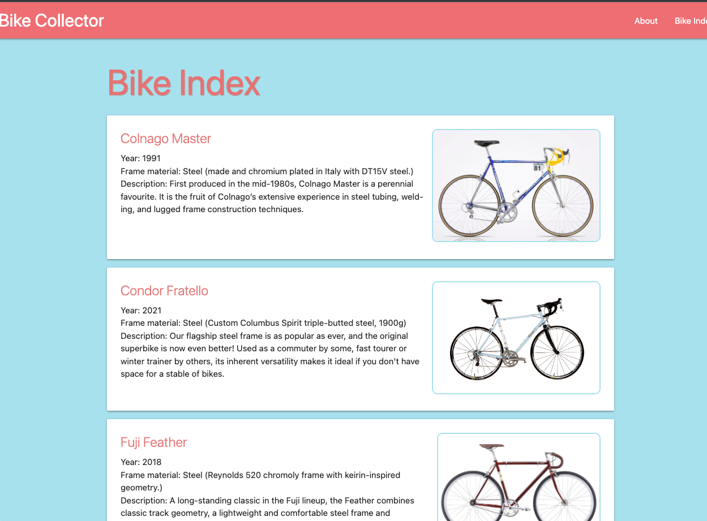

# Bike Collector App        
# Django-postgreSQL Lab Deliverable     

**Login**
_guestUser_ || _guestpw11_      

26/09/22:       

### Beginning project:      
`django-admin startproject` run, local and remote repos established, `python3 manage.py startapp` run.       
`main_app` inserted into `settings.py`, tested working ok on `localhost:8000`.      

Database `bikecollector` created in _pgAdmin4_, connected in `settings.py`. Migrations sent.        

`urls.py` created in app folder, `urls.py` updated in project folder, `'home'` added to app `views.py`.     
- tested working ok using simple HTML.      

`base.html` created in `main_app/templates/` for DTL inheritance, 'about' template also created.        
`main_app/static/css/style.css` added.      

- issues seen where _localhost:8000/about/_ not triggering error but nothing rendering.     
- _issue found_: I had used `HttpResponse` instead of `render` in `views.py`, now working ok.       

### Index functionality:        
- hardcoding sample data into `views.py` in order to implement and test index data.
- added link w/path to `base.html`, updated `urls.py` with path, updated `views.py` request API.        
- `main_app/templates/bikes/index.html` created.
- _Largely working fine, with the exception of when I have tried to concatenate multiple values, workaround like so:_     
    - `<span class="card-title"> {{ bike.make  }} {{ bike.model }} </span>`       
    - started looking at templatetags etc. but have been advised that the above is acceptable!      
- _Also had issues with accessing list by index, later realised that I should be using_ `.index` _rather than_ `[index]`.      
- reversed list using `` - `bikes.reverse()` of course did not work!        
- also able to capitalise `bike.material.0` using `{{bike.material.0 |title }}`.        

27/09/22:        

### Creating Bike Model:        
- creating Bike class in `models.py`, ran `makemigrations` and `migrate` without issue.            
    - avoiding needing to establish a second table for `bike.material` (currently a list):
    - therefore separated out into two properties: `bike.material` and `bike.material_info    
- commented out hard-coded Bike model and dictionaries in `views.py`, imported `Bike` from `.models`.       
- updated `bikes_index` API with `bikes = Bike.objects.all()` - Django ORM.     
- updated `bikes/index.html` to reflect changes to Bike objects.        
- directly inserted test data into _pgAdmin4_, tested working ok.       

### Creating superuser:     
- created superuser 'hphilpotts` for admin, logged in ok.       
- registered `Bike` model in `main_app/admin.py`, successfully added as admin.      

### Adding images:       
- updated `Bike` model to include `image` property. Chose URL as string over upload using `ImageField` to reduce storage and make for simpler implementation. Migrated successfully.        
- `index.html` updated and images added. Some images do not work - image type is important.     
- CSS added to improve appearance:      

      

### Detail view:        
- making images clickable for details view. Added `<a></a>` tags around images in `index.html`, path added in `urls.py`, `views.py` updated.        
- `/bikes/detail.html` created, CSS added.   

- Also, hardcoded urls in `base.html` and `home.html` switched out for _Django_ ``.        

28/09/22        

### Using CBVs to implement Create, Edit and Delete:        

#### Create:        
- link added to `base.html`, path in `urls.py` and `BikeCreate` defined in `views.py`       
- Creating `bike_form.html` in `main_app/templates/main_app/`, `csrf_token` included.       
- _Hit_ `Reverse error` _due to using_ `bike_creates` _in path name, changed to_ `bikes_create`, now working ok.
- added `get_absolute_url` to `Bike` model.     
- _Hit_ `expecting endblock` _error, had used_ `` _rather than_ `{{ form.as_table }}`, now working ok.       
- Full Create functionality tested working ok.      

**Side note: had made minor edits to readme directly in GitHub after yesterday's last commit, causing commit rejection just now.**
_Resolved through the use of_ `git push origin main --force`        

#### Edit and Delete:       
- links added to `/bikes/detail.html`, paths to `urls.py`, CBV classes to `paths.py`.       
- `bike_confirm_delete.html` added.     
- `bike_form.html` updated to load headings responsively depending on if Create or Edit is being performed.     
- Full Edit and Delete Functionalites tested ok.        

### Django One-Many Models:     
- `Component` model added in `models.py`, Foreign Key constraint added, model registered in `admin.py`.        
- Entity has appeared in _Django administration_, working ok to this point.     
- _Getting a Programming Error to do with post - may be resolved as I work through next steps?_      
- `__str__` overwritted for `Bike` in order to provide a more friendly output.      

- `Component` table added to Bike Detail page.      
- `forms.py` added for custom form, imported into `views.py`. `def bikes_detail` updated accordingly.    
- _Above Programming Error fixed_: I had forgotten to migrate the new `Component` model...         
- `<form>` added to Bike Detail, dropdown functionality added through Materialize JS `FormSelect`.      
- All appears working ok.       
- Added `POST` path to `urls.py`, updated `action=""` in `detail.html`, added `def add_feeding` API to `view.py`.       
- Tested working ok!          

29/09/22:       

### Django Many-Many Models:        

#### Creating a new model with all CBV CRUD Ops:        
- `Accessory` model added in `models.py` (with `verbose_name_plural` set to 'accessories'), migrated and verified in _pgAdmin4_     
- links added to `base.html`, paths created.    
- `Accessory` imported into `views.html` along with `ListView` and `DetailView` from `django.views.generic`.        
- CBVs defined in `views.html`.     
- confirm_delete, detail, form and list templates added.        
- eventually tested working ok once spelling errors had been corrected.     

#### Relationing modules:       
- added access to `accessories` on `bikes` - _had to move_ `Accessory` _class definition to above_ `Bike`      
- Migrated, verifed as ok.      
- Paths updated and views updated. Bike Detail template updated to show kit.        
- `Accessory` added to `admin.py`. Checked working ok in admin panel.

- Adding user add/remove kit from bike functionality.       
- Firstly: show non-added kit in Bike detail by adding `kit_not_on_bike` to `bikes_detail` within `views.py`.       
_Need to get my head around exactly how this works:_       
`kit_not_on_bike = Bike.objects.exclude(id__in = bike.accessories.all().values_list('id'))`     
- `/bikes/detail.html` updated to show non-added kit, buttons to add/remove.        
- Eventually tested working ok: _had mixed up bike/accessory in some lines of code_.        

#### Minor adjustments:      
- formatting updated.               
- `class BikeUpdate` edited to remove 'accessories' field.          

30/09/22:       

### Django Authentication and Authorisation:        

#### Collecting 'wild' bikes:       
- `User` imported in `models.py`, user `FK` added to `Bike`.        
- Migrated with `PK` of `1` as default so existing superuser can collect wild bikes.        

#### Adding Authentication URLs:        
- auth paths added to `/bikecollector/urls.py`, checked with expected `TemplateDoesNotExist` error.     
- `login.html` templated added, checked working ok.     
- form added, throws **404** error as expected, `LOGIN_REDIRECT_URL` added. Tested working ok.      

#### Adding login option to nav bar, redirect on logout:        
- Logout and Sign In links added with if statement to show appropriate link. Sign Up commented out as not yet built.        
- Logout redirect to '/about/' added.     
- All tested working ok.        

#### Updating `bike_create` to assign to current user:      
- `form_valid` overridden to automatically set `form.instance.user` to current user before returning to `super` function.       

**Login functionality completed, using built-in Django resources**

#### Signup with Django:        
- `signup` path added to `urls.py`.     
- In `views.py`, manual `signup` API added.     
- Checks if `request.method == "POST"`, if so checks if form input posted is valid.     
- If `form.is_valid()`, creates user and then signs them in before redirecting to index, else gives error message.      
- If not `POST` then (will be get) render signin page, will supply error messages (passed as `object` along with form).     
- `base.html` updated to include Sign In link.      
- `signup.html` template added.     
- All tested working ok.        

_Minor bugs found in templates when checking if new users creating bikes works ok, now resolved_:       
- _had used_ `bike.name` _in error_.        

#### Authorisation:     
- User can only view their own bikes -  `bike_index` in `views.py` updated with `.filter()`.        
- All manual API routes protected with `@login_required` decorator, except Home, About and Sign Up.     
- All CBV routes protected with `LoginRequiredMixin`.       

#### Misc tasks:        
- Welcome message added to detail.html.     
- `.gitignore` file added.      
- `.env` file added to protect Database name, user and password.      
- `settings.py` erased from all previous commits to remove sensitive data using:        
```
index-filter \
    'git rm -rf --cached --ignore-unmatch bikecollector/settings.py' HEAD
```  

#### Visual:        
- Final tweaks made to visuals, Home and About pages.       
- Screenshots below:        

      

      

      

       

      


---     

_Note_: app previously hosted on _Heroku_, redeployed 28/11/22 to .     

---     

### Remaining tasks:        
- add more entries!     


